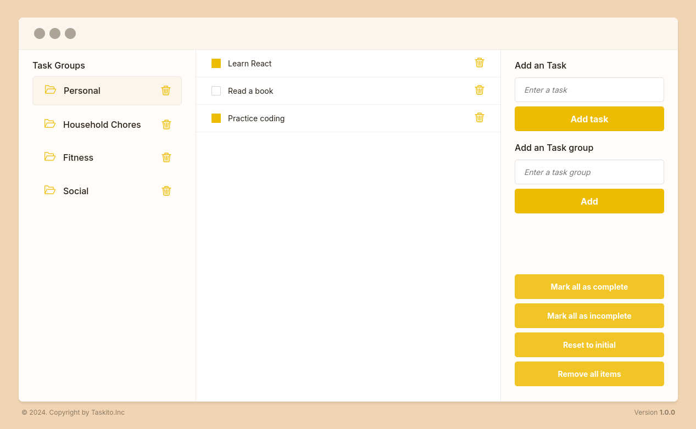

# Taskito

Taskito is a modern task management web application built with React that allows users to organize their tasks into groups and manage them efficiently.



## Features

- ✨ Create and manage multiple task groups
- ✅ Add, complete, and delete tasks
- 💾 Persistent storage using localStorage
- 🎯 Bulk actions for tasks (mark all complete/incomplete)
- 🗂️ Group management (add/delete groups)
- 💻 Desktop-optimized interface
- 🎨 Clean and intuitive user interface

## Technologies Used

- React
- JavaScript (ES6+)
- CSS3
- Local Storage for data persistence

## Getting Started

To get started, follow these steps:

1. Clone the repository:

```bash
git clone https://github.com/kuzagaya/todo-app.git
```

2. Navigate to the project directory:

```bash
cd todo-app
```

3. Install the dependencies:

```bash
npm install
```

4. Start the development server:

```bash
npm run dev
```

5. Open your browser and navigate to `localhost` to see the app in action.

## Contributing

Contributions are welcome! If you find any issues or have suggestions for improvements, please open an issue or submit a pull request on the GitHub repository.
